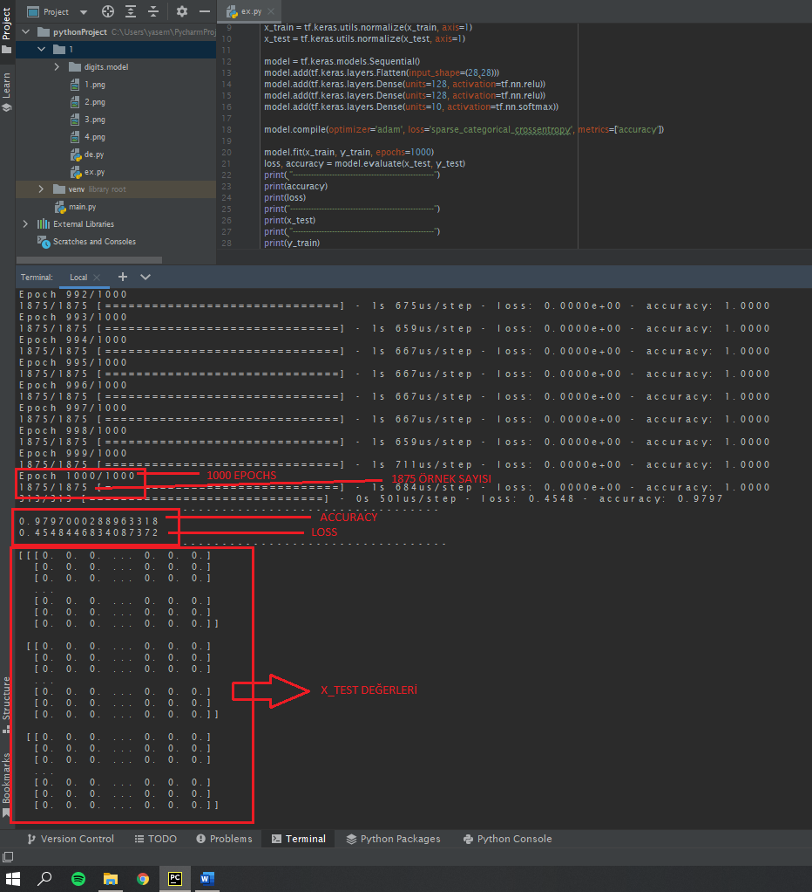
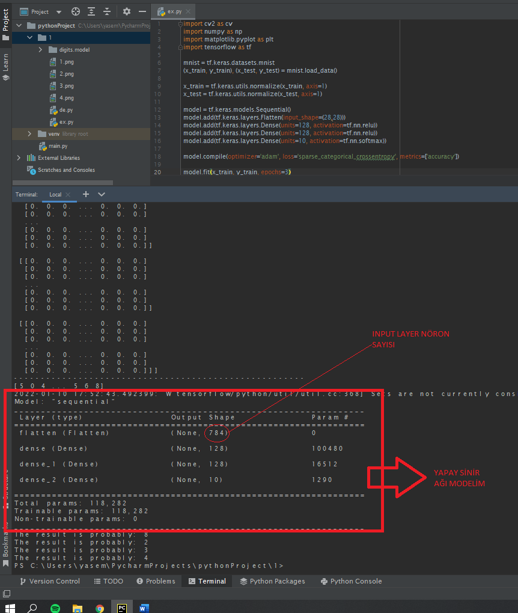
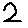
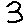
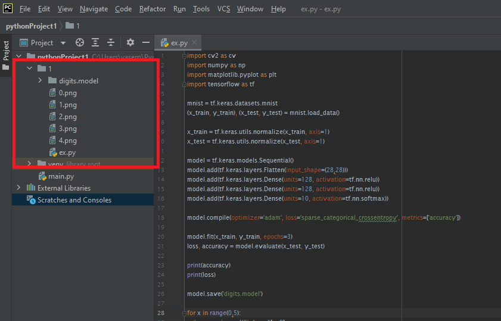
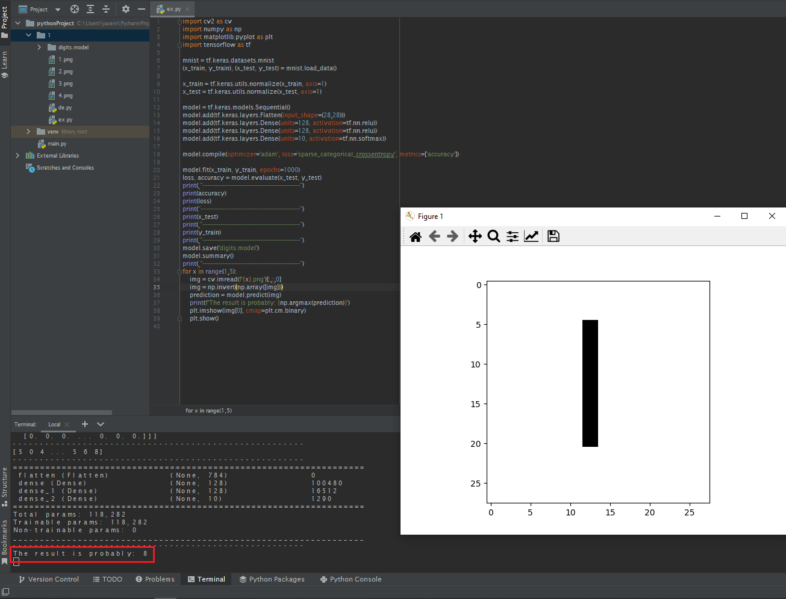
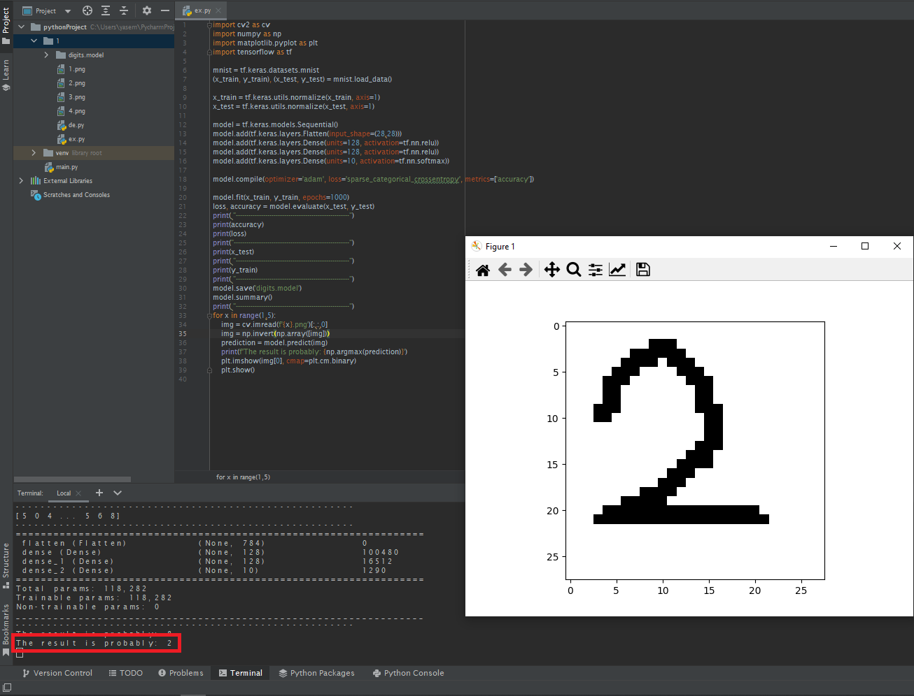
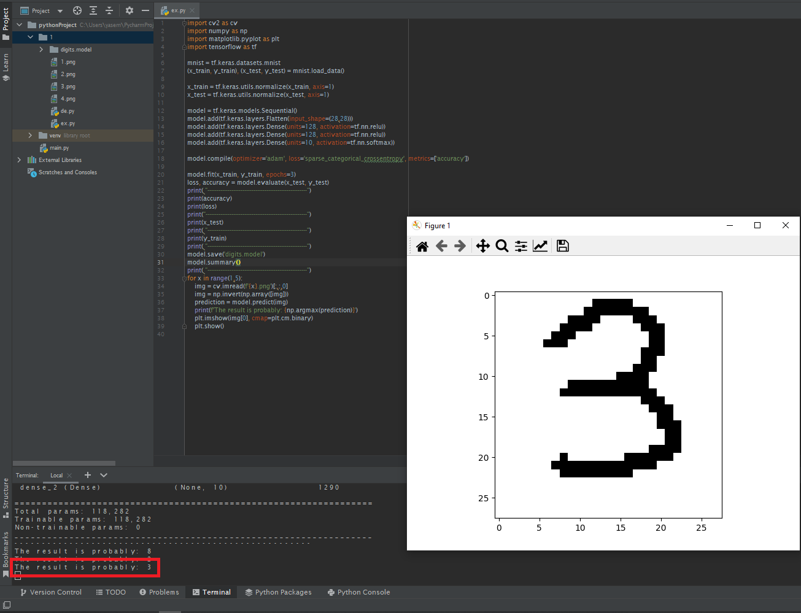
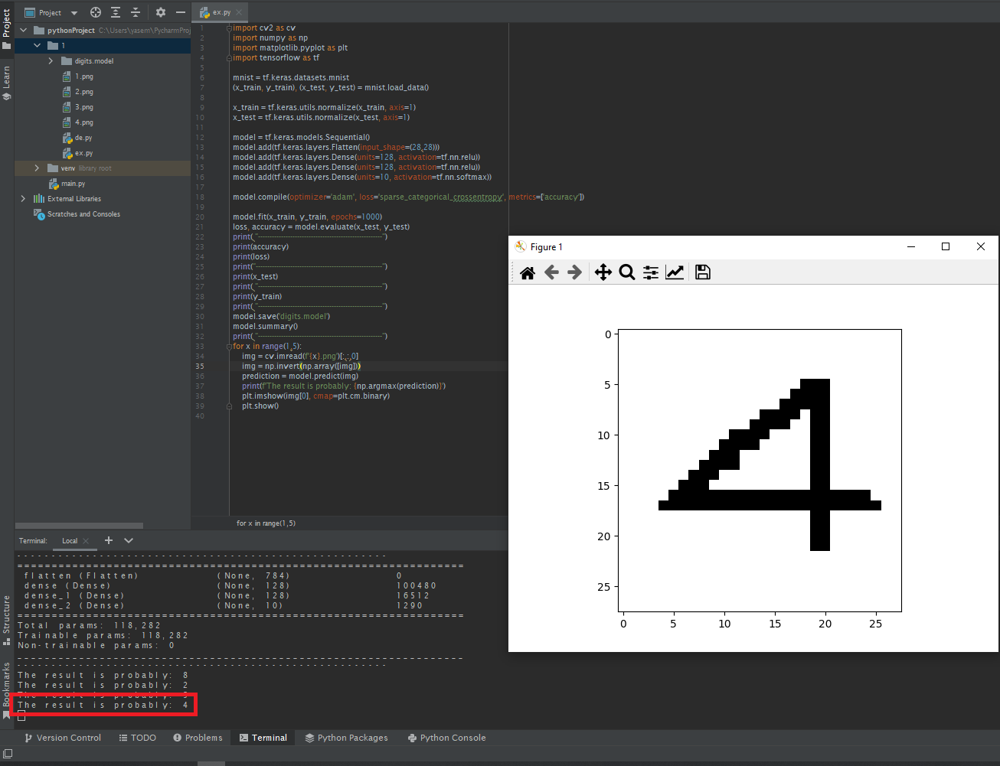

# Handwritten Digits
Öncelikle 4 temel kitaplığı import etmem gerekiyor: Ilki opencv kütüphanesi olan cv2, bu kütüphaneyi sinir ağını eğitmek için kullanmayacağım. Bu kütüphane sonradan paintte çizdiğim resimleri ekleyeceğim zaman kullanacağım. Numby kütüphanesi. Matris çarpımları için gereklidir bu kütüphane. Matplotlib kütüphanesi. Görselleştirmeler için gerekli. Son olarak eklemem gereken ana kütüphane tensorflow. Bu kütüphane yapay sinir ağlarını inşa etmemi, data almamı ve sinir ağını test etmemi sağlayacak.

Sonra handwritten digit veri setini yüklemem gerekiyor. mnist değişken isminde 
*	mnist = tf.keras.datasets.mnist
diyerek MNIST veri setinden verileri çekiyorum. 1875 adet veri var elimde.

load_data() fonksiyonu ile Mnist’ten aldığım verileri hem yükleyip hem de eğitim ve test verileri olarak bölüyorum.
*	( x_train, y_train ), ( x_test, y_test ) = mnist.load_data()

Eğitim verilerini ve test verilerini normalleştiriyorum.
*	x_train = tf.keras.utils.normalize( x_train, axis = 1 )
x_test = tf.keras.utils.normalize( x_test, axis = 1 )

Model ismini verdiğim yapay sinir ağı modelimi oluşturuyorum.
*	model = tf.keras.models.Sequential()

Modelime giriş olarak 28*28 pixel resim gireceğim. Modelimi bunu karşılayacak şekilde layer oluşturmasını sağlıyorum. Giriş katmanına 28*28 pixel veri gireceğim için 748 tane nöronum var.
*	model.add( tf.keras.layers.Flatten( input_shape = ( 28, 28 ) ) )

128 tane nöron ve aktivasyon fonksiyonu olarak rectify linear unit function( relu ) seçiyorum. 
*	Model.add( tf.keras.layers.Dense( units = 128, activation = tf.nn.relu )
Iki tane hidden layer olacağı için kodu iki kere yazdım. 

Output layer, çıkış katmanında 0, 1, 2 , 3, … , 9 tane çıktım olacağı için 10 tane nöronum var ve aktivasyon fonksiyonu olarak softmax seçtim.
*	model.add( tf.keraslayer.Dense( units = 10, activation = nf.nn.sotfmax ) )

Hepsini toplarlıyorum.
*	model.compile( optimizer = ‘adam’, loss = ‘sparse_categorical_crossentropy’, mectrics = [ ‘accuracy’ ] )

Sonunda modelimi epoch sayısını 1000 seçerek fit metodu ile eğitiyorum. 
*	model.fit( x_train, y_train, epochs = 1000 )

Train verilerine güvenemeyeceğimiz için test verilerindeki accuracy ve loss hesabı yapıyorum.
*	loss, accuracy = model.evalute( x_test, y_test )
X_test verilerim;
*	print( x_test )
 

Modelimi digit.model olarak kodun buluduğu klasörün içine kaydediyorum
*	model.save( ‘digit.model’ )

Şimdi yapay sinir ağımıza bir bakalım.
*	model.summary()
 
 

Daha sonra paintte 28*28 pixel boyutlarında bazı sayılar yazıyorum. 

Bunları PyCharm’da kodların bulunduğu klasörün içine atıyorum. 

 
Son olarak modelin klasöre attığım resimleri tahmin edebilmesi için gerekli olan kodu yazıyorum.
*	for x in range(0,5):
  *  	img = cv.imread(f'{x}.png')[:,:,0]
  *  	img = np.invert(np.array([img]))
  * 	prediction = model.predict(img)
  *  	print(f'The result is probably: {np.argmax(prediction)}')
  *  	plt.imshow(img[0], cmap=plt.cm.binary)
  *  	plt.show()
      
Oluşturduğum modelin sonuçları:

